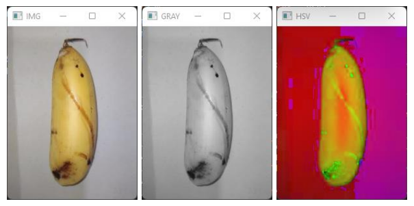
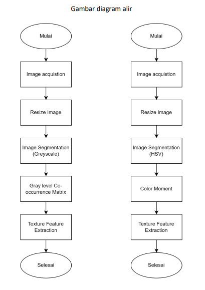

# Implementasi Gray level Co-occurrence Matrix dan Color Moment
## Klasifikasi Pisang Jenis Kelapasari dengan Pisang Jenis Awak Menggunakan Fitur Warna dan Tesktur
Projek ini bertujuan untuk mengklasifikasikan pisang kelapasari dengan pisang awak dengan memanfaatkan implementasi dari esktrasi fitur warna dan tesktur. Ekstraksi fitur tekstur akan menggunakan Gray level Co-occurrence Matrix dengan mengambil nilai dari contrast nya sedangkan ekstraksi fitur warna menggunakan Color Moment dengan mengambil nilai H, S, dan V dari mean nya.

### Segmentasi


### Flowchart


### Libraries used (python)
```
Numpy
OpenCV (cv2)
Sklearn
``` 

### Dataset
```
Dokumentasi Pribadi Peneliti
``` 
